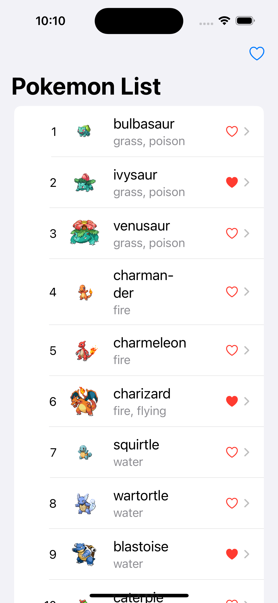
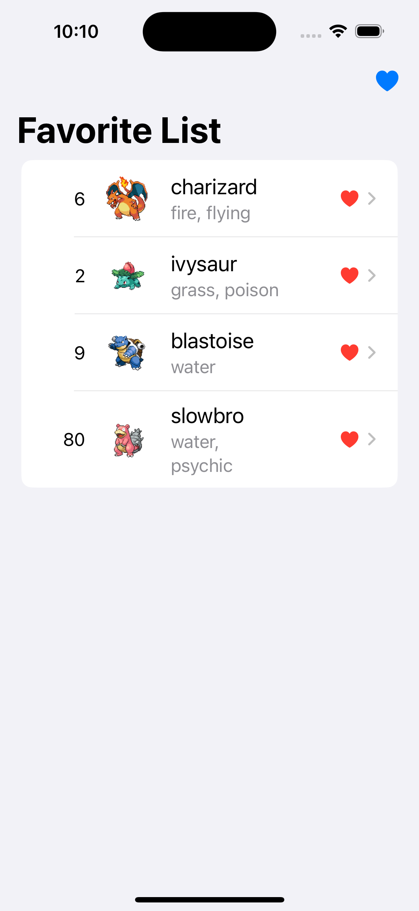
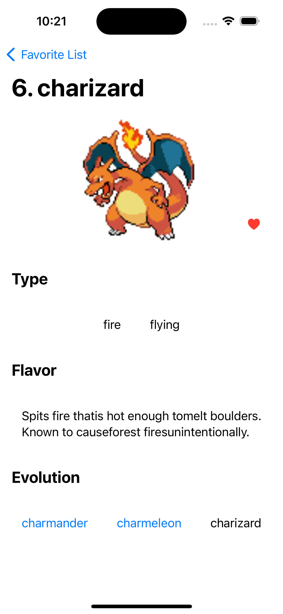

# GoGoLookPokemon

## Project Overview
GoGoLookPokemon is a mobile application that enables users to search for and access information about various Pokemon. The app offers a user-friendly interface for browsing through an extensive collection of Pokemon, including their appearances, names, types, flavors, and evolution chains.

    

On the Pokemon List page, users can explore basic information about each Pokemon, such as their name, image, and type.

    

The heart icon on the right side of each cell allows users to add or remove Pokemon from their favorite list. To switch between the favorite list and the Pokemon list, users can tap the heart icon located at the top right corner of the screen.

    

By tapping on a Pokemon from the list, users can access detailed information about that Pokemon, including its name, image, type, flavor, and evolution chain.

## Running the Application
To run the application, follow these steps:
1. Clone the repository to your local machine.
2. Open the project in Xcode.
3. Install any necessary dependencies using Swift package manager.
4. Build and run the project on a simulator or a physical device.

## Design Patterns
In the implementation of GoGoLookPokemon, I have utilized the following design patterns and frameworks:

1. SwiftUI: Used to build the application's user interface.
2. Combine framework: Employed to handle asynchronous data flow.
3. MVVM design pattern: Separates presentation logic from business logic.
4. Dependency Injection: Enables the provision of necessary dependencies to view models.
5. URLCache: Applied to cache image data from network requests.
6. Local storage: Utilized to store the favorite Pokemon list and cache API response data.
7. Unit tests: Ensures the correctness of application components.
8. FiredTofu network layer: A self-implemented network layer for handling RESTful API requests and responses. The source code can be found in my GitHub repository [FiredTofu](https://github.com/rickhung76/FiredTofu).

These design patterns and frameworks enhance the clarity, maintainability, and testability of the codebase.

## LLM Tools

During the development process, I leveraged ChatGPT and GitHub Copilot to assist me in writing code, unit tests, and documentation. Additionally, I utilized these tools for decoding the JSON response from the Pokemon API for faster implementation on data models.
